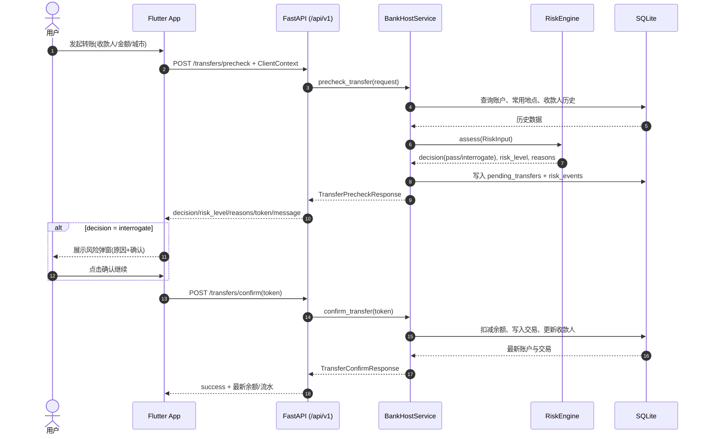
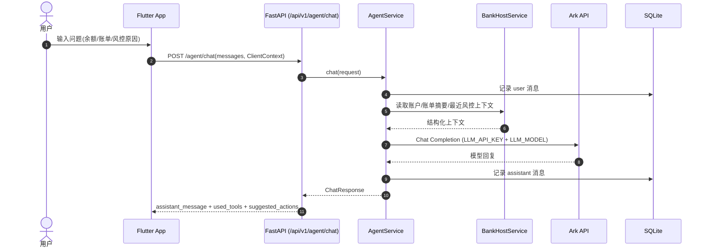

# Sequence Diagrams

## 1) 转账风控与确认链路

```mermaid
sequenceDiagram
    autonumber
    actor U as 用户
    participant F as Flutter App
    participant API as FastAPI (/api/v1)
    participant Host as BankHostService
    participant Risk as RiskEngine
    participant DB as SQLite

    U->>F: 发起转账(收款人/金额/城市)
    F->>API: POST /transfers/precheck + ClientContext
    API->>Host: precheck_transfer(request)
    Host->>DB: 查询账户、常用地点、收款人历史
    DB-->>Host: 历史数据
    Host->>Risk: assess(RiskInput)
    Risk-->>Host: decision(pass/interrogate), risk_level, reasons
    Host->>DB: 写入 pending_transfers + risk_events
    Host-->>API: TransferPrecheckResponse
    API-->>F: decision/risk_level/reasons/token/message

    alt decision = interrogate
        F-->>U: 展示风险弹窗(原因+确认)
        U->>F: 点击确认继续
    end

    F->>API: POST /transfers/confirm(token)
    API->>Host: confirm_transfer(token)
    Host->>DB: 扣减余额、写入交易、更新收款人
    DB-->>Host: 最新账户与交易
    Host-->>API: TransferConfirmResponse
    API-->>F: success + 最新余额/流水
```

## 2) AI 聊天链路（豆包/方舟）

```mermaid
sequenceDiagram
    autonumber
    actor U as 用户
    participant F as Flutter App
    participant API as FastAPI (/api/v1/agent/chat)
    participant Agent as AgentService
    participant Host as BankHostService
    participant DS as Ark API
    participant DB as SQLite

    U->>F: 输入问题(余额/账单/风控原因)
    F->>API: POST /agent/chat(messages, ClientContext)
    API->>Agent: chat(request)
    Agent->>DB: 记录 user 消息
    Agent->>Host: 读取账户/账单摘要/最近风控上下文
    Host-->>Agent: 结构化上下文
    Agent->>DS: Chat Completion (LLM_API_KEY + LLM_MODEL)
    DS-->>Agent: 模型回复
    Agent->>DB: 记录 assistant 消息
    Agent-->>API: ChatResponse
    API-->>F: assistant_message + used_tools + suggested_actions
```
