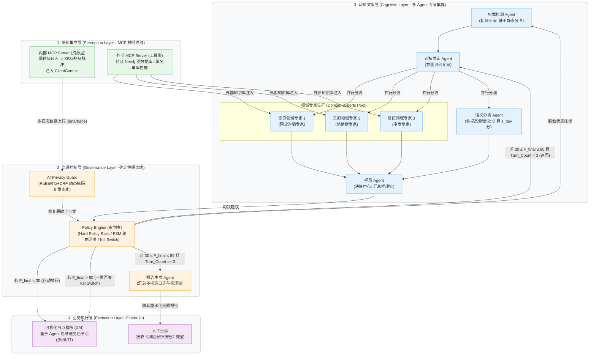

```mermaid
graph TD
    classDef layerStyle fill:#f8f9fa,stroke:#ced4da,stroke-width:2px,rx:10px,ry:10px;
    classDef agentStyle fill:#e3f2fd,stroke:#90caf9,stroke-width:2px;
    classDef mcpStyle fill:#e8f5e9,stroke:#a5d6a7,stroke-width:2px;
    classDef govStyle fill:#fff3e0,stroke:#ffcc80,stroke-width:2px;
    classDef uiStyle fill:#f3e5f5,stroke:#ce93d8,stroke-width:2px;

    %% 4. 业务执行层 (Execution Layer)
    subgraph Execution_Layer ["4. 业务执行层 (Execution Layer -Flutter UI)"]
        direction LR
        UI["可视化节点看板 (XAI)<br/>基于 Agent 思维链变色节点<br/>(灰/绿/红)"]:::uiStyle
        Human["人工坐席<br/>接收《风险分析报告》兜底"]:::uiStyle
    end

    %% 3. 认知决策层 (Cognitive Layer)
    subgraph Cognitive_Layer ["3. 认知决策层 (Cognitive Layer - 多 Agent 专家集群)"]
        direction LR
        S_Agent["犯罪检测 Agent<br/>(初筛专家: 基于静态分 S)"]:::agentStyle
        Q_Agent["对抗质询 Agent<br/>(意图识别专家)"]:::agentStyle
        
        %% 领域专家集群 (MoE)
        subgraph Domain_Expert_Pool ["领域专家集群 (Domain Experts Pool)"]
            D1["垂直领域专家 1<br/>(网贷诈骗专家)"]:::agentStyle
            D2["垂直领域专家 2<br/>(杀猪盘专家)"]:::agentStyle
            D3["垂直领域专家 3<br/>(电商专家)"]:::agentStyle
        end
        
        M_Agent["语义分析 Agent<br/>(多模态测谎仪: 计算 s_dev 分)"]:::agentStyle
        C_Agent["柜员 Agent<br/>(决策中心: 汇总推理链)"]:::agentStyle
        
        S_Agent --> Q_Agent
        Q_Agent -- "并行分流" --> D1
        Q_Agent -- "并行分流" --> D2
        Q_Agent -- "并行分流" --> D3
        Q_Agent -- "并行分流" --> M_Agent
        
        D1 --> C_Agent
        D2 --> C_Agent
        D3 --> C_Agent
        M_Agent --> C_Agent
    end

    %% 2. 治理控制层 (Governance Layer)
    subgraph Governance_Layer ["2. 治理控制层 (Governance Layer -确定性隔离线)"]
        direction LR
        Privacy["AI-Privacy Guard<br/>(RoBERTa+CRF 动态掩码 & 重水化)"]:::govStyle
        Policy["Policy Engine (审判者)<br/>(Hard Policy Rails / FSM 路由网关 / Kill Switch)"]:::govStyle
        Report["报告生成 Agent<br/>(汇总多模态日志与推理链)"]:::govStyle
        
        Privacy -- "修复脱敏上下文" --> Policy
        Policy -- "脱敏状态注塑" --> S_Agent
        C_Agent -- "判决建议" --> Policy
    end

    %% 1. 感知集成层 (Perception Layer)
    subgraph Perception_Layer ["1. 感知集成层 (Perception Layer - MCP 神经总线)"]
        direction LR
        Int_MCP["内部 MCP Server (资源型)<br/>毫秒级日志 -> KB级特征脉冲<br/>注入 ClientContext"]:::mcpStyle
        Ext_MCP["外部 MCP Server (工具型)<br/>封装 Neo4j 图数据库 / 黑名单库插槽"]:::mcpStyle
    end

    %% Data Flow
    %% 数据上行阶段
    Int_MCP -- "多模态数据上行 (data/trace)" --> Privacy
    
    %% 并行计算簇：MCP工具调用 (State 1)
    Ext_MCP -- "外部知识库注入" --> D1
    Ext_MCP -- "外部知识库注入" --> D2
    Ext_MCP -- "外部知识库注入" --> D3
    
    %% DFA 状态跳转与自动拦截分支 (State 2/3 分流)
    Policy -- "若 F_final < 30 (自动放行)" --> UI
    Policy -- "若 F_final > 80 (一票否决 Kill Switch)" --> UI
    
    %% FSM 循环通路 (node_ask_again)
    Policy -- "若 30 ≤ F_final ≤ 80 且 Turn_Count < 3 (追问)" --> Q_Agent

    %% 最终审判与执行落地 (node_human_report)
    Policy -- "若 30 ≤ F_final ≤ 80 且 Turn_Count == 3" --> Report
    Report -- "隐私重水化还原报告" --> Human
    
    class Execution_Layer,Cognitive_Layer,Governance_Layer,Perception_Layer layerStyle;
```